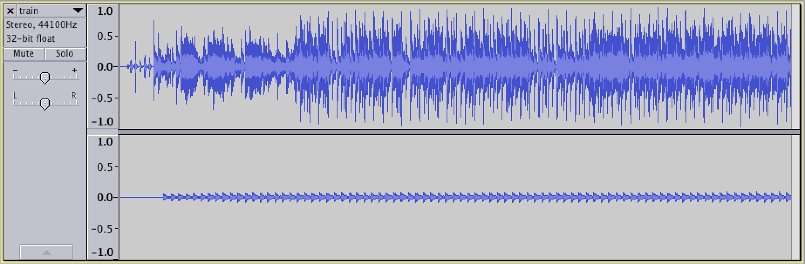

# Accelerator (300)

## Problem

Hey, do you want to learn more about Steganography? Cool, read [this](https://mega.nz/#!sYt2SCTD!0PNX2SaWn5gDfrv3LlguHDMVJqKJbbJFk9WUrjpRROw) article. Just friendly learning. We're not hiding ANYTHING \*nervous laugh\*

## Hint

Yeah chaosagent likes Accelerator blah blah blah

##Writeup

We notice that the file seems unusually large for a PDF file, so let's open it up in hexdump.

`$ hexdump -C Downloads/steg.pdf`

This gives us a bunch of gibberish, which ends with:

```
0105ffb0  98 60 9e 3b db 2d a3 3e  dc 55 b8 3b fc ac a4 3e  |.`.;.-.>.U.;...>|
0105ffc0  c1 5c d4 3b a4 f9 ab 3e  14 5d ee 3b 54 a0 ac 3e  |.\.;...>.].;T..>|
0105ffd0  23 31 01 3c 8f 75 a1 3e  52 b4 fe 3b 2c d9 94 3e  |#1.<.u.>R..;,..>|
0105ffe0  d1 e3 d2 3b 74 d2 8e 3e  57 83 6a 3b 4c 00 8d 3e  |...;t..>W.j;L..>|
0105fff0  45 6d b9 b9 7c 9e 8e 3e  27 fa 7c bb 08 e7 93 3e  |Em..|..>'.|....>|
```

So far, nothing seems unusual. Google tells us that PDFs should begin with `%PDF` and end with the end of file tag, `%%EOF`. But our PDF doesn't. Let's look for the `%%EOF`

`$ hexdump -C Downloads/steg.pdf | grep EOF`

This returns three instances of EOF.

```
000c8640  62 51 0a 56 69 42 45 2f  2f 58 4a 5a 34 45 4f 46  |bQ.ViBE//XJZ4EOF|
000f3790  74 26 33 45 4f 46 71 29  55 54 61 5d 69 43 5a 30  |t&3EOFq)UTa]iCZ0|
00118280  45 4f 46 0d 52 49 46 46  84 b0 93 04 57 41 56 45  |EOF.RIFF....WAVE|
```

Printing three lines before each instance, we notice that only the last one yields `%%EOF`.

`$ hexdump -C Downloads/steg.pdf | grep -B 3 EOF`

```
000c8610  6d 69 39 49 73 2e 30 58  38 6b 2f 4b 61 5b 29 52  |mi9Is.0X8k/Ka[)R|
000c8620  30 56 33 22 6f 59 2c 57  55 68 4a 4e 39 4f 5d 73  |0V3"oY,WUhJN9O]s|
000c8630  6f 60 6b 48 6b 35 44 50  39 5a 75 39 22 38 30 59  |o`kHk5DP9Zu9"80Y|
000c8640  62 51 0a 56 69 42 45 2f  2f 58 4a 5a 34 45 4f 46  |bQ.ViBE//XJZ4EOF|
--
000f3760  47 56 22 25 6d 60 70 3c  5a 38 62 3a 43 2f 3c 2c  |GV"%m`p<Z8b:C/<,|
000f3770  6b 72 5a 62 70 33 70 3b  51 5d 3e 6f 0a 38 49 55  |krZbp3p;Q]>o.8IU|
000f3780  63 37 28 6f 5d 2e 28 35  53 46 5f 43 67 71 57 3e  |c7(o].(5SF_CgqW>|
000f3790  74 26 33 45 4f 46 71 29  55 54 61 5d 69 43 5a 30  |t&3EOFq)UTa]iCZ0|
--
00118250  63 38 64 62 32 39 39 30  64 61 34 36 31 31 34 61  |c8db2990da46114a|
00118260  30 33 35 34 62 37 3e 5d  0d 3e 3e 0d 73 74 61 72  |0354b7>].>>.star|
00118270  74 78 72 65 66 0d 31 31  34 34 36 32 34 0d 25 25  |txref.1144624.%%|
00118280  45 4f 46 0d 52 49 46 46  84 b0 93 04 57 41 56 45  |EOF.RIFF....WAVE|
```

We also notice that immediately after the `%%EOF` are `RIFF` and `WAVE`. Once again, google comes to the rescue, telling us that these are parts of the file header of the `WAVE` soundfile format. Opening up the file in a hex editor, we copy all of the data into a new file with file extention `.wav`.

As it turns out, this [file](files/train.wav) is the song *Hey, Soul Sister* by Train. We open it up in audacity and notice that the right channel looks quite unusual. It consists entirely of two notes, one high and one low. Using 1 for the high notes and 0 for the low notes, we can transcribe the notes.



This yields `1001100111001000010101011000000011001000100100000100000000100111001101011100110110011`

We notice that this string is 85 bits long, which isn't the correct length for binary. On the other hand, 85 can be factored into `5 * 17`. We also note that the notes seem close together, perhaps A's and B's. This leads us to guess that the text could be a [baconian cipher](https://en.wikipedia.org/wiki/Bacon%27s_cipher).

Replacing all of the 1s with Bs and the 0s with As, we get `BAABBAABBBAABAAAABABABABBAAAAAAABBAABAAABAABAAAAABAAAAAAAABAABBBAABBABABBBAABBABBAABB`

Plugging this into [rumkin](http://rumkin.com/tools/cipher/baconian.php), we get `THEFLAGISBACONONT`.

##Flag
`easyctf{baconont}`

## External Writeups

* https://github.com/ztaylor54/CTF/blob/master/EasyCTF%202015/accelerator.md
