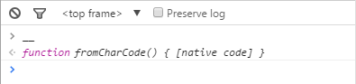

# Easter (100)

## Problem

[page](https://www.easyctf.com/static/problems/easter/easter.html)

## Hint

Just look around.

## Writeup

In the source code of the page, we see a large number of calls to the function `__`. Let's check what this function does.



Turns out, `__` is just the same as `fromCharCode`! So the huge blob of code is simply constructing a string from the ASCII values of each character. Let's see what this string decodes to:


```javascript
if (window.addEventListener) {
	var index = 0;
	var konami = [38, 38, 40, 40, 37, 39, 37, 39, 66, 65, 13];

	window.addEventListener("keydown", function(e) {
		if (e.keyCode === konami[index]) {
			index++; //valid key at the valid point

			if (index == konami.length) {
				document.getElementById("valerie").innerHTML = "01111011011011010110100101110011011100110110100101101111011011100111001101110101011000110110001101100101011100110111001101111101";
			}
		} else {
			// incorrect code restart
			index = 0;
		}
	});
}
```

Looks like if we correctly enter a Konami code, we get a binary string. Decoding this string from binary gives us the flag.

```python
>>> hex(int("01111011011011010110100101110011011100110110100101101111011011100111001101110101011000110110001101100101011100110111001101111101", 2)).strip("0x").strip("L").decode("hex")
'{missionsuccess}'
```

## Flag

`{missionsuccess}`

## External Writeups

* https://github.com/1lastBr3ath/EasyCTF-2015-Writeup/blob/master/web.md
* https://github.com/DavidJacobson/EasyCTF-2015-writeup/blob/master/web.md#easter---100-pts
