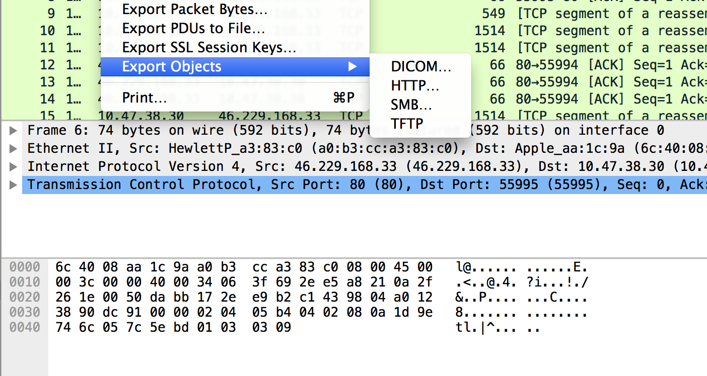
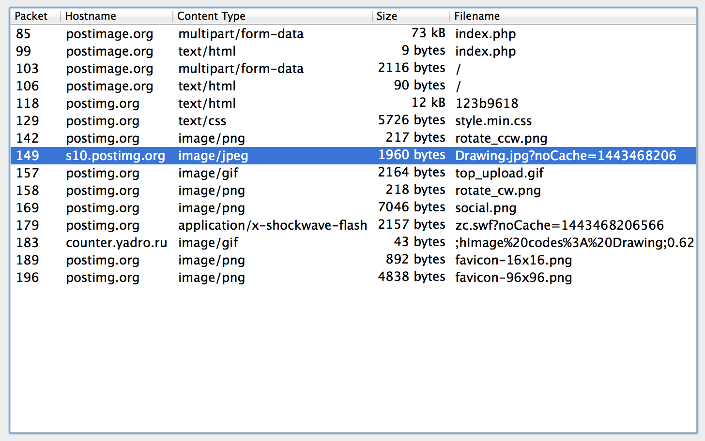

# iSpy (120)

## Problem

We intercepted some suspicious network activity. We think that the enemy has been exchanging important data. Can you help us figure out what it is? You can find a copy of the file [here](files/ispy.pcapng).

## Hint

You're going to need to be able to open that file. Something like [Wireshark](https://www.wireshark.org) might help.

## Writeup

Actually Wireshark was not entirely necessary in solving this challenge.

### Wireshark Method

We open the file in wireshark, like the hint tells us to do.

The problem tells us that "the enemy has been exchanging important data", so we take a look at the HTTP objects (File > Export Objects > HTTP)



Scanning the files, we see a suspicious object called `Drawing.jpg`



Saving this, we get an image with the flag


### tcpdump Method

We open the file using tcpdump. In the terminal, we type

`$ tcpdump -ns 0 -X -r ispy.pcapng`

Near the bottom, we see a suspicious instance of `IEND`

```
	0x0310:  db5d ec5f f74f 2f33 c6c2 41e0 0000 0000  .]._.O/3..A.....
	0x0320:  4945 4e44 ae42 6082                      IEND.B`.
```

This suggests a PNG file. Modifying our command to grep for instances of PNG, we type

`$ tcpdump -ns 0 -X -r ispy.pcapng | grep PNG`

This returns

```
reading from PCAP-NG file ispy.pcapng
	0x00c0:  8950 4e47 0d0a 1a0a 0000 000d 4948 4452  .PNG........IHDR
	0x0130:  7465 730d 0a0d 0a89 504e 470d 0a1a 0a00  tes.....PNG.....
	0x0130:  7465 730d 0a0d 0a89 504e 470d 0a1a 0a00  tes.....PNG.....
	0x0130:  2062 7974 6573 0d0a 0d0a 8950 4e47 0d0a  .bytes.....PNG..
	0x0130:  7974 6573 0d0a 0d0a 8950 4e47 0d0a 1a0a  ytes.....PNG....
	0x0130:  2062 7974 6573 0d0a 0d0a 8950 4e47 0d0a  .bytes.....PNG..
```

Ah, so it IS an image. We want to see if we can find anything else, so we print the 50 lines before each instance.

`$ tcpdump -ns 0 -X -r ispy.pcapng | grep -B 50 PNG`

The entry that is third from the bottom shows a suspicious looking website

```
	0x0050:  312e 310d 0a48 6f73 743a 2070 6f73 7469  1.1..Host:.posti
	0x0060:  6d67 2e6f 7267 0d0a 436f 6e6e 6563 7469  mg.org..Connecti
	0x0070:  6f6e 3a20 6b65 6570 2d61 6c69 7665 0d0a  on:.keep-alive..
	0x0080:  5573 6572 2d41 6765 6e74 3a20 4d6f 7a69  User-Agent:.Mozi
	0x0090:  6c6c 612f 352e 3020 284d 6163 696e 746f  lla/5.0.(Macinto
	0x00a0:  7368 3b20 496e 7465 6c20 4d61 6320 4f53  sh;.Intel.Mac.OS
	0x00b0:  2058 2031 305f 395f 3529 2041 7070 6c65  .X.10_9_5).Apple
	0x00c0:  5765 624b 6974 2f35 3337 2e33 3620 284b  WebKit/537.36.(K
	0x00d0:  4854 4d4c 2c20 6c69 6b65 2047 6563 6b6f  HTML,.like.Gecko
	0x00e0:  2920 4368 726f 6d65 2f34 352e 302e 3234  ).Chrome/45.0.24
	0x00f0:  3534 2e31 3031 2053 6166 6172 692f 3533  54.101.Safari/53
	0x0100:  372e 3336 0d0a 4163 6365 7074 3a20 2a2f  7.36..Accept:.*/
	0x0110:  2a0d 0a52 6566 6572 6572 3a20 6874 7470  *..Referer:.http
	0x0120:  3a2f 2f70 6f73 7469 6d67 2e6f 7267 2f69  ://postimg.org/i
	0x0130:  6d61 6765 2f79 6371 3078 777a 736c 2f31  mage/ycq0xwzsl/1
	0x0140:  3233 6239 3631 382f 0d0a 4163 6365 7074  23b9618/..Accept
	0x0150:  2d45 6e63 6f64 696e 673a 2067 7a69 702c  -Encoding:.gzip,
	0x0160:  2064 6566 6c61 7465 2c20 7364 6368 0d0a  .deflate,.sdch..
	0x0170:  4163 6365 7074 2d4c 616e 6775 6167 653a  Accept-Language:
	0x0180:  2065 6e2d 5553 2c65 6e3b 713d 302e 380d  .en-US,en;q=0.8.
	0x0190:  0a43 6f6f 6b69 653a 205f 5f63 6664 7569  .Cookie:.__cfdui
	0x01a0:  643d 6461 3734 3236 6138 3764 6436 3964  d=da7426a87dd69d
	0x01b0:  3832 3730 3838 3239 6437 6261 6466 3564  82708829d7badf5d
	0x01c0:  3965 6131 3433 3938 3338 3135 310d 0a0d  9ea1439838151...
	0x01d0:  0a                                       .
```

We go to [http://postimg.org/image/ycq0xwzsl/123b9618/](http://postimg.org/image/ycq0xwzsl/123b9618/) to see the same image as before

## Flag

`easyctf{pcap_fun!??}`

## External Writeups

* https://github.com/1lastBr3ath/EasyCTF-2015-Writeup/blob/master/forensics.md
