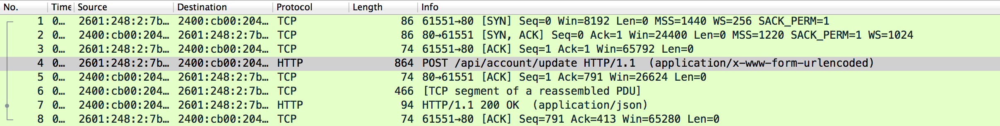
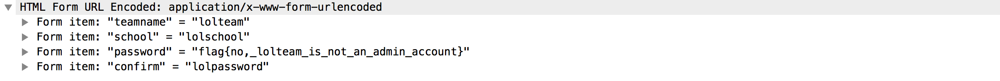

# lolteam (65)

## Problem

There's a suspicious team out there called **lolteam**, I got my eyes on them for a while and I managed to [wiretap](files/lolteam.pcapng) their browser as they were changing their password. What did they change their password to?

## Hint

Don't know how to open [.pcapng](http://fileinfo.com/extension/pcapng) files?

## Writeup

Opening up the file in Wireshark, we scan the packets and see a `POST` request, which seems pretty important.

Digging around in the packet, we see the lolteam password, which also happens to be the flag.

## Flag

`easyctf{no,_lolteam_is_not_an_admin_account}`

## External Writeups

* http://benichmt1.github.io/tutorial/2015/11/12/EasyCTF-2015-writeup/
* https://github.com/1lastBr3ath/EasyCTF-2015-Writeup/blob/master/forensics.md