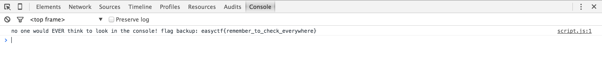

# Plot Twist (20)

## Problem

We need to get the flag at [this](https://www.easyctf.com/static/problems/plot-twist/index.html) site. That shouldn't be too hard.

## Hint

There must be a backup on that site SOMEWHERE . . . you just have to look harder

## Writeup

Using inspect element, we look in the console and see the flag.

## Flag

`easyctf{remember_to_check_everywhere}`

## External Writeups

* https://github.com/ztaylor54/CTF/blob/master/EasyCTF%202015/Plot_Twist.md
* https://github.com/1lastBr3ath/EasyCTF-2015-Writeup/blob/master/web.md