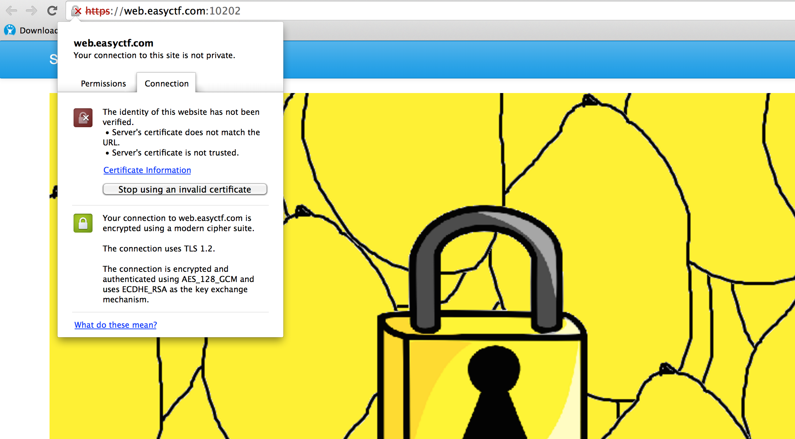
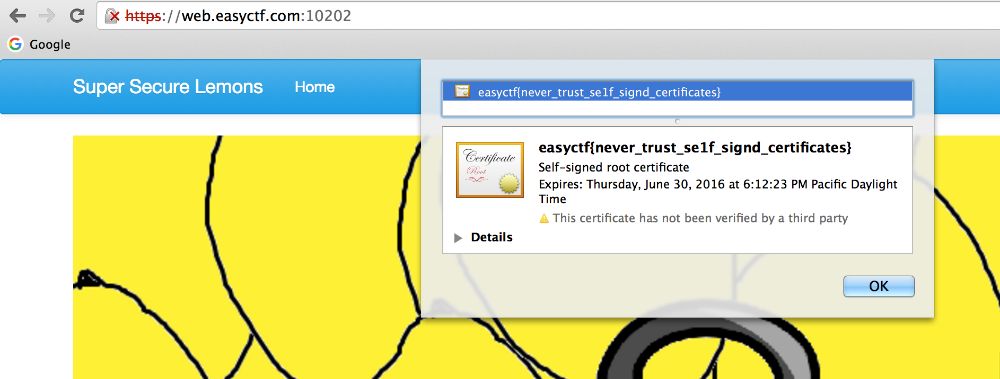

# Super Secure Lemons (225)

## Problem

This [site](https://web.easyctf.com:10202) uses an encryption technology to keep its lemons super secure! On second thought, it might not be as secure as we thought.

## Hint

Why is your browser giving you that funny security message?

##Writeup
When we click the link, we get redirected to a page that tells us that the connection is not secure. This and the problem suggest that we should take a look at the security certificate.

This can be done by right-clicking the page and clicking view page info (if you're on chrome or firefox).

The flag is in the certificate!

##Flag
`easyctf{never_trust_se1f_signd_certificates}`

## External Writeups

* https://github.com/1lastBr3ath/EasyCTF-2015-Writeup/blob/master/web.md
* https://github.com/DavidJacobson/EasyCTF-2015-writeup/blob/master/web.md#super-secure-lemons---225-pts
