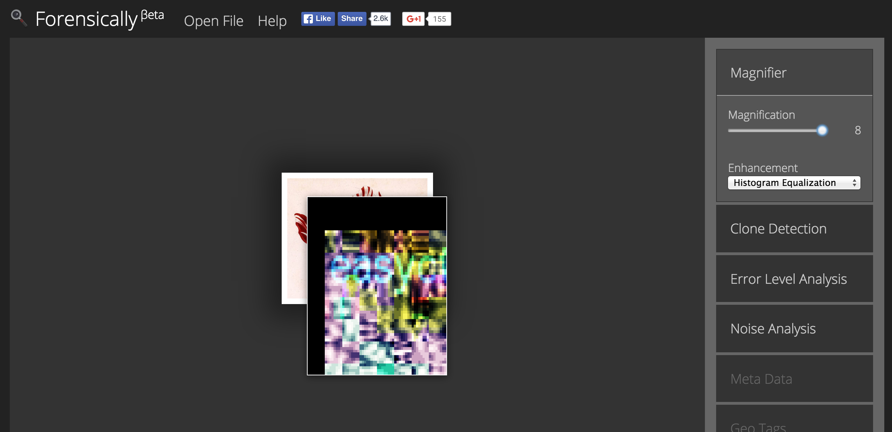

# Who is this god? (175)

## Problem

My friend Mich uses this nice [tulip](files/tulip.png) as her profile pic because she likes historical stuff. Did I mention that one of the EasyCTF developers worships her as a god?

## Hint

A tulip a day keeps the economy away :)

P.S. Everything you need is in the image...although you might need sharper vision.

##Writeup
Neither `strings` nor `exiftool` reveals anything odd about the image, so we suspect that the flag is part of the viewed image. In addition, the later hint tells us that we need sharper vision, suggesting that we need to sharpen parts of the image to view the flag.

This can be accomplished through either using an image manipulation program like Photoshop or GIMP, or using this handy [tool](http://29a.ch/photo-forensics/#forensic-magnifier), suggested by **1lastBr3ath** in his writeup :)

Using this tool to scan the image, we see that the flag in the top left corner of the image.

##Flag
`easyctf{all_hail_michy}`

## External Writeups

* https://gist.github.com/1lastBr3ath/9e4a91f0470ec176c0ad
* https://github.com/1lastBr3ath/EasyCTF-2015-Writeup/blob/master/forensics.md